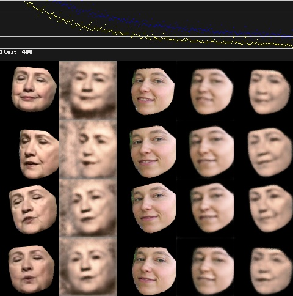

## DeepFaceLab Colab for Newbies

I made my first [DeepFaceLab](https://github.com/iperov/DeepFaceLab) deepfake on Google Colab. 

Most of the material about using DeepFaceLab on Colab assumed the user was already familiar with DeepFaceLab's workflow.

However, if you have a Mac or other computer without an Nvidia GPU, you might need to use colab to get started with DeepFaceLab. So I added explanation on how to use DeepFaceLab on Colab for newbies.

*Fork from [DFL-Colab](https://github.com/chervonij/DFL-Colab), a DeepFaceLab fork for Google Colab made by [@chervonij](https://github.com/chervonij).*

## Making A (Bad) Deepfake
I made a (very undertrained) deepfake using DeepFaceLabs. 

This is my first deepfake using an *autoencoder* model, the kind of model that [DeepFaceLab](https://github.com/iperov/DeepFaceLab) uses. Other deepfakes I've made with [Avatarify](https://github.com/alievk/avatarify) used First Order Motion Model.

#### Why is this deepfake so bad?

I trained this model on a small amount of data and iterations: 38 source images for 500 iterations. That's not enough to produce a quality deepfake. 

It's common to train for 100k or more iterations. And use hundreds or thousands of source images.

But my goal with this first deepfake was to get through the DeepFaceLab workflow, not make a great deepfake. Hopefully, this repo can help you get through it as well. 

*The preview image for my model at 400 iterations.*

### **Getting Started**
1. Download the repo
2. Upload DFL_Colab_Newb.ipynb to your Google Drive and open in Google Colab. 
   
I've added extra explanations and code within the Jupyter Notebook file to help newbies get started.

### **Deepfake Readings:**
* **Tech Behind Deepfakes #1:** [link](https://www.alanzucconi.com/2018/03/14/an-introduction-to-autoencoders/)
* **Tech Behind Deepfakes #2:** [link](https://www.alanzucconi.com/2018/03/14/understanding-the-technology-behind-deepfakes/)

### **DeepFaceLab Guides:**
* **DeepFaceLab 2.0 Guide:** [link](https://mrdeepfakes.com/forums/thread-guide-deepfacelab-2-0-explained-and-tutorials-recommended)
* **Google Colab Guide:** [link](https://mrdeepfakes.com/forums/thread-guide-deepfacelab-google-colab-tutorial)
  

# Donate
Please consider [donating](https://github.com/iperov/DeepFaceLab#how-i-can-help-the-project) to DeepFaceLab. This project is open source and a lot of hard work went into it.

## *Orignal Readme below:*

## DFL-Colab — *DeepFaceLab fork for Google Colab*

This project provides you IPython Notebook to use DeepFaceLab with Google Colaboratory.  
You can create your deepfake video even if you don’t have a powerful GPU on a desktop PC.

Keep in mind that working with a remote server imposes some restrictions.  
Because of this, working with DFL-Colab is not so convenient as working with DeepFaceLab directly on your computer.

DFL-Colab uses DeepFaceLab and to understand the workflow, you should first understand the DeepFaceLab workflow.

**Official Links**
- **DFL-Colab Notebook**: [Link](https://colab.research.google.com/github/chervonij/DFL-Colab/blob/master/DFL_Colab.ipynb) -- Works with latest DFL version
- **DFL-Colab Notebook 1.0**: [Link](https://colab.research.google.com/github/chervonij/DFL-Colab/blob/master/DFL_Colab_1-0.ipynb) -- Works with DFL 1.0 version
- **DeepFaceLab Repository**: [Link](https://github.com/iperov/DeepFaceLab)
- **Youtube channel**: [Link](https://www.youtube.com/channel/UCTKBl8kB6DJ_qLnk1NGDGbQ)

**Community support**
- **Telegram Chat** (English/Russian): [Link](https://t.me/DeepFaceLab_official)
- **MrDeepFakes Forum**: [Link](https://mrdeepfakes.com/forums/)
- **MrDeepFakes DFL-Colab Guide**: [Link](https://mrdeepfakes.com/forums/thread-guide-deepfacelab-google-colab-tutorial)
- **MrDeepFakes DeepFaceLab Guide**: [Link](https://mrdeepfakes.com/forums/thread-guide-deepfacelab-explained-and-tutorials)
- **Reddit — r/GifFakes/**: [Link](https://www.reddit.com/r/GifFakes/new/)
- **Reddit — r/SFWdeepfakes/**: [Link](https://www.reddit.com/r/SFWdeepfakes/new/)
